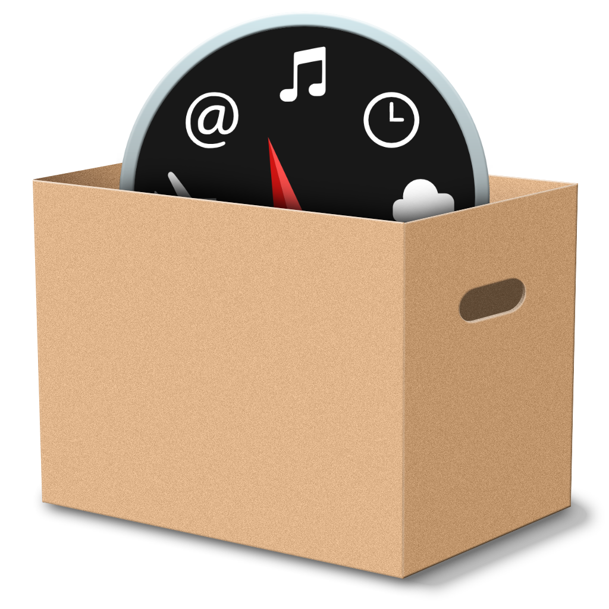

# dashbox

**A  dashboard in the box for the new generations of MacOS.**

Dashboard was introduced with Mac OS X 10.4, disabled by default from OS X 10.10 Yosemite and finally removed in macOS 10.15 Catalina. For 11+ years it was a main app to run simple applications called widgets which included world clock, calculator, dictionary and all sort of converters. These might come handy on daly basis to everyone who works on international level.

## Goal

**dashbox** is an attempt to preserve the functionality of dashboard app for the post-mojave versions of MacOS.

It wont be an exact copy but rather a homage to dashboard app. The *look and feel* should be preserved but the details which have some room for improvement **should not** be blindly copied. 

## Roadmap

- [ ] Save the current state
- [ ] Add sticky note
- [ ] Add World Clock
- [ ] Add Calculator
    - [ ] Improve it by adding "scientific" functions on flip
- [ ] Add converter app
    - [ ] Improve it by adding tabs for categories instead of combobox

## Contribute

Feel free to clone this repo and add widgets of your choice.

## To Use

To clone and run this repository you'll need [Git](https://git-scm.com) and [Node.js](https://nodejs.org/en/download/) (which comes with [npm](http://npmjs.com)) installed on your computer. From your command line:

```bash
# Clone this repository
git clone https://github.com/1GR3/dashbox
# Go into the repository
cd dashbox
# Install dependencies
npm install
# Run the app
npm start
```


## License

[CC0 1.0 (Public Domain)](LICENSE.md)
